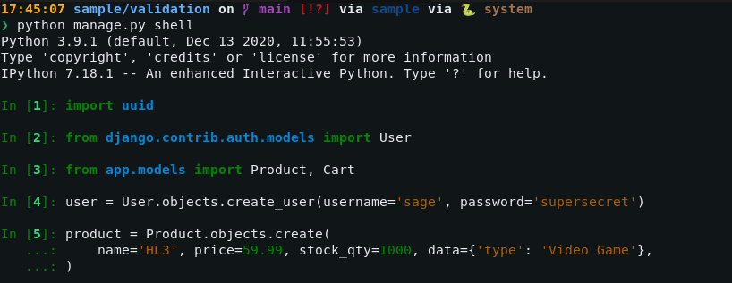
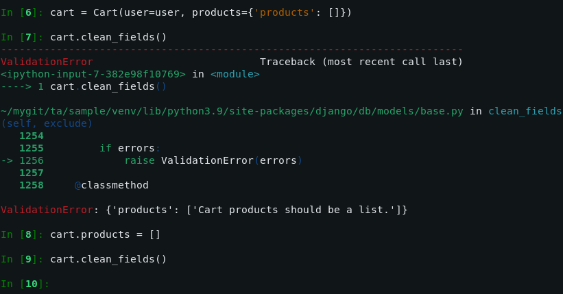
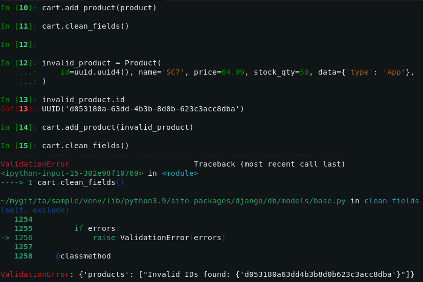
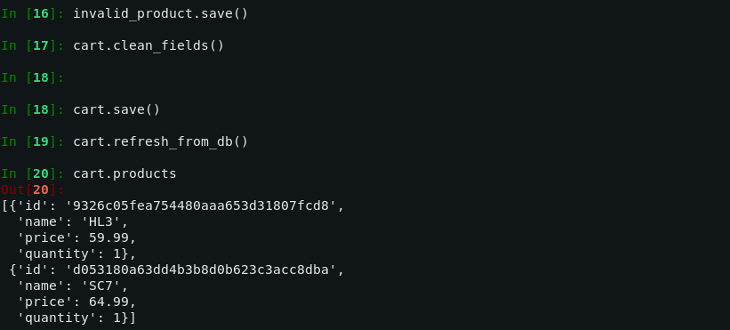

# `JSONField` validation example

Follow the demonstration below to see how the validation works.






If needed, some data fixtures are available in the [`app/fixtures`](app/fixtures/) directory. To load the data, do:

```shell
python manage.py loaddata app/fixtures/data.json
```
